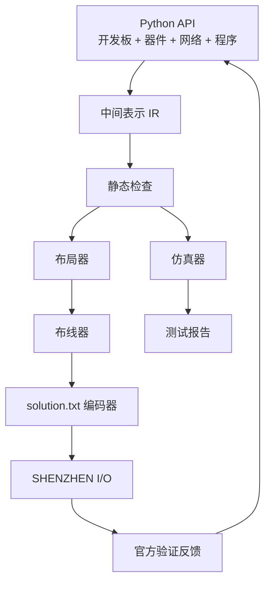

# SHENZHEN I/O 解题工具链设想

## 背景

SHENZHEN I/O 的官方保存文件是明文文本，通常包含：

```txt
[name] Codex solution
[puzzle] Sz035

[traces]
...

[chip]
[type] UC6
[x] 11
[y] 6
[code]
  ...
```

这意味着我们不必完全依赖游戏 GUI 来拖器件、连线和调代码。理论上可以构建一个外部工具链：

1. 用 Python API 描述开发板、器件、连接和控制逻辑。
2. 编译生成游戏可读取的 `solution.txt`。
3. 在外部仿真大部分逻辑，减少反复关游戏、改文件、开游戏验证的次数。

游戏仍然作为最终裁判，因为官方验证器、隐藏测试和 UI 行为才是权威结果。

## 目标

- 把器件抽象成可编程对象。
- 把每道题的开发板抽象成可布局、可布线、可仿真的对象。
- 用连接代码描述电路拓扑，而不是手写 `[traces]` 字符网格。
- 用器件逻辑代码描述 MC4000、MC6000 等芯片程序。
- 自动布局器件，自动布线，生成 SHENZHEN I/O 保存文件。
- 实现外部仿真器，提前发现常见错误：
  - 引脚类型不匹配。
  - 未连接引脚。
  - XBus 读写阻塞或漏读。
  - 简单 I/O 输出时序不符合预期。
  - 芯片代码行数、寄存器、引脚使用不合法。
- 实现 testbench 框架，让每道题可以用输入时序和期望输出时序测试。

## 非目标

- 不追求一开始就完全复刻游戏验证器。
- 不追求自动最优化成本、功耗、代码行数。
- 不依赖题解数据库。
- 不修改游戏二进制。

## 总体架构



## Python API 设计

用户侧不再设计独立 DSL，而是直接写 Python。原因：

- Python 本身已经有模块、函数、类、变量、类型提示和 IDE 支持。
- 解题时需要大量程序化生成、枚举布局、复用子电路，Python 比 YAML/自研 DSL 更自然。
- 方案对象可以直接被 checker、simulator、builder 使用，不需要额外文本解析层。
- 仍然可以把 `parts.yaml`、`boards/*.yaml` 作为数据库，但用户不直接用 YAML 写方案。

### 用户侧方案示例

```python
from shzio import Solution
from shzio.boards import Sz035
from shzio.parts import MC6000


class VirtualRealityBuzzer(Solution):
    board = Sz035
    name = "vr-buzzer-mc6000"

    def build(self):
        radio = self.board.radio
        buzzer = self.board.buzzer

        cpu = self.place(MC6000(), at=(11, 5))

        self.connect(radio.rx, cpu.x0)
        self.connect(cpu.p1, buzzer.input)

        p = cpu.program()
        buzz = p.label("buzz")

        p.tcp(cpu.x0, 0)
        p.plus.mov(1, cpu.dat)
        p.plus.jmp(buzz)
        p.minus.jmp(buzz)
        p.mov(0, cpu.dat)

        p.mark(buzz)
        p.teq(cpu.dat, 1)
        p.plus.not_()
        p.minus.mov(0, cpu.acc)
        p.mov(cpu.acc, cpu.p1)
        p.slp(1)
```

这个 API 的关键点：

- `MC6000()` 是芯片类实例，不是字符串。
- `cpu.x0`、`cpu.p1` 是 `Pin` 对象，带类型、方向、物理位置。
- `cpu.acc`、`cpu.dat` 是 `Register` 对象。
- `self.board.radio` 和 `self.board.buzzer` 来自开发板类，不需要用户手写固定器件字符串。
- `self.connect()` 建立类型化网络，能在编译前检查 simple/XBus 是否混接。
- `cpu.program()` 是指令构造器，最终生成 MCxxxx 汇编。

### 更高级的芯片逻辑 API

除了逐条写指令，还可以给常见状态机提供结构化 API。它不是隐藏时序的普通高级语言，而是能显式落到 MCxxxx 寄存器、标签和 `slp` 的受限 EDSL。

示例：

```python
cpu = self.place(MC6000(), at=(11, 5))
enabled = cpu.state(cpu.dat, initial=0)
phase = cpu.state(cpu.acc, initial=0)

with cpu.tick() as t:
    cmd = t.read_nonblocking(cpu.x0, empty=-999)

    t.when(cmd == 1).then(enabled.set(1))
    t.when(cmd == 0).then(enabled.set(0))

    t.when(enabled == 1).then(
        phase.toggle_0_100(),
        cpu.p1.write(phase),
    ).otherwise(
        phase.set(0),
        cpu.p1.write(0),
    )
```

编译器需要输出：

```text
target: MC6000
register allocation:
  enabled -> dat
  phase -> acc
pins:
  x0, p1
estimated lines: 10 / 14
```

第一版可以只实现指令构造器；结构化状态机 API 放在第二步做。这样不会一开始就陷入复杂编译器设计。

## 器件抽象

每个器件需要一份规格定义：

```yaml
type: UC6
game_type: UC6
size:
  w: 4
  h: 3
cost: 5
registers:
  - acc
  - dat
pins:
  x0:
    kind: xbus
    side: left
    offset: 0
  x1:
    kind: xbus
    side: left
    offset: 1
  p0:
    kind: simple
    side: left
    offset: 2
  p1:
    kind: simple
    side: right
    offset: 0
  x3:
    kind: xbus
    side: right
    offset: 1
  x2:
    kind: xbus
    side: right
    offset: 2
```

这里的关键是：不能只知道器件有 `p1`，还要知道 `p1` 在芯片图形上的哪一侧、哪一格。否则换芯片类型后很容易出现 `p1` 代码正确但线实际接到 `x3` 的问题。

需要维护的器件信息：

- 游戏内部 `[type]` 名称。
- 器件尺寸。
- 引脚名称。
- 引脚类型：`simple` 或 `xbus`。
- 引脚方向：输入、输出、双向或由上下文决定。
- 引脚物理位置。
- 是否是关卡固定器件。
- 成本。
- 可用寄存器。
- 最大代码行数。

## 开发板抽象

只做器件引脚数据库还不够。SHENZHEN I/O 的每一道题都有自己的开发板，开发板本身决定了：

- 可放置区域。
- 禁布区和缺口。
- 外部信号端口的位置。
- 关卡固定器件的位置。
- 哪些器件是 puzzle-provided，不能删除或移动。
- 哪些外部端口是 simple 输入、simple 输出、XBus 输入、XBus 输出。
- 默认验证信号名称，例如 `无线rx`、`蜂音器`。

因此工具链需要把开发板作为一等对象，而不是把它隐含在 solution 文件里。

示例：

```yaml
id: Sz035
name: virtual-reality-buzzer

grid:
  width: 22
  height: 14
  placeable:
    # 第一版可以先用矩形和排除区描述；必要时再升级成 bitmask。
    rectangles:
      - [4, 1, 17, 11]
    holes:
      - [4, 10, 1, 2]
      - [8, 1, 1, 1]

fixed_parts:
  radio:
    type: RADIO
    x: 7
    y: 5
    provided: true

external_ports:
  radio_rx:
    label: 无线rx
    kind: xbus
    direction: input
    owner: radio.rx
    nonblocking: true
    empty_value: -999

  buzzer:
    label: 蜂音器
    kind: simple
    direction: output
    anchor:
      side: board
      x: 16
      y: 7
```

开发板抽象和器件抽象的关系：

- `parts.yaml` 描述“某种器件长什么样、有哪些引脚”。
- `boards/Sz035.yaml` 描述“这道题的板子上有哪些固定器件和外部端口”。
- `solutions/virtual_reality_buzzer.py` 只描述“我要放哪些额外器件、怎么连接、芯片写什么代码”。

这样编译器才能检查：

- 方案是否试图移动固定器件。
- 方案是否把线画到板子外或缺口里。
- 方案是否把 `cpu.p1` 连接到了开发板上的 `buzzer` 外部端口。
- 方案中的 `radio.rx` 是否来自这道题提供的非阻塞 XBus 输入。

### 开发板来源

开发板数据可以从三处构建：

1. `Content/strings.csv` 和手册：信号名称、通用器件名、UI 错误类型。
2. 现有 solution `.txt`：固定器件、初始布局、实际 `[traces]` 网格尺寸。
3. 游戏界面观察：板子边界、缺口、外部端口锚点。
4. 自定义规格 Lua：`get_board()` 的 ASCII 板面和 `create_terminal()` 的端子声明。

手册负责说明通用器件和通用接口；关卡开发板负责说明“这道题具体把哪些外部东西接到了板上”。这两个数据库是互补关系。

## 中间表示 IR

执行 Python solution 后生成一个中间表示：

```text
Design
  puzzle: Sz035
  board: Board(Sz035)
  parts:
    radio: FixedPart(type=RADIO, fixed=true, from_board=true)
    cpu: Part(type=UC6)
    buzzer: BoardPort(kind=simple_output)
  nets:
    Net(kind=xbus): radio.rx <-> cpu.x0
    Net(kind=simple): cpu.p1 <-> buzzer.input
  programs:
    cpu: MCxxxxProgram(...)
```

IR 的作用是把“用户想表达的电路”与“游戏保存文件怎么写”分离。

## 静态检查

编译前先做静态检查：

- 每条网络只能连接同类型引脚：
  - XBus 只能连 XBus。
  - simple I/O 只能连 simple I/O。
- 芯片代码不能引用不存在的寄存器或引脚。
- MC4000 最多 9 行，MC6000 最多 14 行。
- 不能读写未连接引脚，除非显式允许。
- 对普通 XBus 读取可能阻塞，仿真时需要建模。
- 对非阻塞 XBus 读取无数据时返回 `-999`。
- 一个时间单位内需要 `slp` 或阻塞，否则报告“持续循环”风险。

这些检查可以在生成 `solution.txt` 前发现大量低级错误。

## 布局器

布局器输入 IR 和开发板模型，输出每个可移动器件的 `[x] [y]` 坐标。

第一版可以非常保守：

- 固定关卡自带器件位置。
- 固定开发板外部端口位置。
- 用户可以手动指定关键器件位置。
- 自动布局只负责给未指定器件找空位。
- 优先让相连引脚对齐，降低布线复杂度。
- 禁止把器件放到开发板不可用区域或缺口上。

示例：

```yaml
parts:
  cpu:
    type: UC6
    place:
      x: 11
      y: 6
```

第二版再做自动布局：

- 枚举候选位置。
- 计算连接线曼哈顿距离。
- 惩罚引脚不对齐。
- 惩罚穿过器件。
- 选择总代价最低的布局。

## 布线器

布线器负责把网络转换成 `[traces]` 字符网格。

保存文件中的 `[traces]` 是整个电路板的导线编码。每个字符表示一个格子的导线形状，例如直线、拐角、T 形连接等。这个映射需要从已有方案文件和实际游戏表现中反推并固定成表。

布线器需要处理：

- 网格坐标系统。
- 开发板可布线区域。
- 开发板外部端口锚点。
- 器件占用区域。
- 引脚到网格的接入点。
- simple 与 XBus 不能混线。
- 多条线不能非法交叉。
- 支持桥接器时，可以允许跨线。

第一版不必做复杂全局布线，可以采用：

1. 用户手写少量 `route hint`。
2. 工具把 hint 编码成 `[traces]`。
3. 如果没有 hint，则走简单 A* 布线。

示例：

```yaml
routes:
  radio.rx_to_cpu:
    points:
      - radio.rx
      - [8, 6]
      - [9, 7]
      - cpu.x0

  cpu_to_buzzer:
    points:
      - cpu.p1
      - [15, 7]
      - buzzer.input
```

## solution.txt 编码器

编码器把 IR、布局和布线结果写成游戏保存文件：

```txt
[name] vr-buzzer-mc6000
[puzzle] Sz035

[traces]
...

[chip]
[type] UC6
[x] 11
[y] 6
[code]
  ...
```

需要注意：

- 游戏开着时不要写保存目录，退出时可能被游戏覆盖。
- 编译器可以先输出到 `build/`，确认后再复制到游戏保存目录。
- 每次写入前备份旧方案。

## 仿真器

仿真器的目标是执行 MCxxxx 代码和器件行为，提前发现明显错误。

### MCxxxx 执行模型

需要实现：

- `acc`、`dat`。
- `p0`、`p1`、`x0`、`x1`、`x2`、`x3`。
- 标签。
- 条件执行：`+` 和 `-`。
- `mov`、`jmp`、`slp`、`slx`。
- 测试指令：`teq`、`tgt`、`tlt`、`tcp`。
- 算术指令：`add`、`sub`、`mul`、`not`、`dgt`、`dst`。
- `gen` 可以展开成：

```asm
mov 100 P
slp X
mov 0 P
slp Y
```

### 时间模型

每个芯片在一个时间单位内执行多条指令，直到：

- 遇到 `slp`。
- 遇到 `slx` 并等待 XBus。
- XBus 读写阻塞。
- 发生运行错误。

仿真器每个 tick 推进所有芯片和外部设备。

### simple I/O

simple I/O 是持续电平，范围 `0..100`。

建模方式：

- 输出端写入值后保持该值。
- 输入端读取当前网络值。
- 如果多个输出驱动同一 simple 网络，报告冲突。

### XBus

XBus 是离散数据包，不是持续电平。

建模方式：

- 普通 XBus：读写双方同一时间握手，缺一方则阻塞。
- 非阻塞 XBus：无数据时读出 `-999`，不会阻塞。
- 一个数据包可能包含多个值，需要支持同一 tick 内连续读取。

## Testbench

每道题可以写一个 testbench：

```python
from shzio.test import Testbench
from shzio.boards import Sz035


class VirtualRealityBuzzerTest(Testbench):
    board = Sz035

    def build(self):
        radio = self.board.radio
        buzzer = self.board.buzzer

        self.input(radio.rx).at(0, -999).at(1, 1).at(2, -999).at(5, 0)

        self.expect(buzzer.output) \
            .at(0, 0) \
            .at(1, 100) \
            .at(2, 0) \
            .at(3, 100) \
            .at(5, 0)
```

Testbench 框架输出：

```text
FAIL t=7 signal=buzzer expected=0 actual=100
```

对于官方测试数据不可直接读取的题，可以先人工录入验证面板的波形，形成近似 testbench。最终仍以游戏验证为准。

## CLI 工作流

建议提供几个命令：

```powershell
shzio check .\solutions\virtual_reality_buzzer.py
shzio sim .\solutions\virtual_reality_buzzer.py .\tests\virtual_reality_buzzer.py
shzio build .\solutions\virtual_reality_buzzer.py -o .\build\virtual-reality-buzzer-2.txt
shzio install .\build\virtual-reality-buzzer-2.txt
```

`install` 需要检查游戏是否运行：

```text
ERROR: Shenzhen.exe is running. Close the game before installing solution files.
```

## 完整开发计划

这里的第一阶段不是最终 MVP，而是“可行性验证里程碑”：用最少功能证明对象模型、保存文件编码、静态检查和游戏读档链路能闭环。验证通过后继续推进完整工具链。

### Milestone 0: 事实库和反推实验

- 从手册建立通用器件事实库：
  - MC4000、MC6000、MC4000X、DX300、存储器、无线电等。
  - 尺寸、成本、寄存器、最大代码行数、引脚类型、引脚物理 offset。
- 从现有 solution 和游戏界面建立开发板事实库：
  - 每题 `board_id`、网格尺寸、固定器件、外部端口、缺口和禁布区域。
  - 至少先覆盖 `Sz035`。
- 反推 `[traces]` 字符表：
  - 已知 `1/2/4/8/3/5/6/9/A/C`。
  - 补齐 `7/B/D/E/F` 的 T 形和十字连通含义。
  - 已确认 `0` 会出现在真实保存文件里，当前按无连接位处理；生成时仍统一写 `.`。
- 产出：`parts`、`boards`、`traces` 基础数据库和验证样例。

公开资料调查结论：

- 暂时没有找到可直接复用的“官方内置谜题开发板数据库”。
- GitHub Gist 上的 `get_board()`、`create_terminal()` 风格不是社区任意格式，而是 SHENZHEN I/O 自定义规格 Lua API 的实际用法。`get_board()` 使用 ASCII art 描述 18x7 board，`create_terminal()` 明确给出 terminal 名称、board 字符、类型和方向。这个模型和我们的 `BoardSpec` 很接近，值得参考。
- Steam Workshop 页面确认 SHENZHEN I/O 的 Workshop 目标就是“创建和分享自己的谜题”，而不是官方内置谜题源码分发。
- Steam 讨论里确认下载的 puzzle Lua 文件会落到本地 `%shenzhen_config_location%/workshop`，说明用户自定义题的数据源可以直接读取。
- SteamDB cloud-save 配置显示 `custom_puzzles` 是游戏同步目录；Windows depot 文件列表没有 `.lua` 文件类型，只有文本描述、资源、PDF、DLL/EXE 等。这和本地安装目录扫描结果一致：官方内置题没有以明文 Lua 随游戏发布。
- 本地安装包包含 `MoonSharp.Interpreter.dll`，说明游戏确实内置 Lua 解释器；这支持“自定义规格由 Lua 执行”的判断，但不能推出“内置官方谜题也以 Lua 存储”。
- 因此：官方内置题仍需要从 `Content/descriptions.*`、保存文件、手册和界面观察建模；Workshop/自定义题可以直接走 Lua 抽取路径。
- 游戏更新日志提到 terminal/bridge 等行为曾经修过 bug，因此我们的 checker 要以当前本地游戏行为为准，不能只依赖旧讨论。

当前已实现的基础层：

- `shzio.cli parts-info`：导出当前器件/引脚数据库 JSON。
- `shzio.cli boards-info`：导出当前开发板数据库 JSON。
- `shzio.cli custom-info`：从单个自定义规格 Lua 抽取 `get_board()`、terminal、radio 和 dial 元数据。
- `shzio.cli scan-custom`：扫描本地 `custom_puzzles`/`workshop` 目录下的 Lua 规格文件。
- `shzio.cli scan-saves`：扫描本地 solution `.txt`，汇总 puzzle id、trace 尺寸、芯片坐标和 puzzle-provided 器件。
- `tests/test_trace_physics.py`：回归验证 `Sz035` 上 MC6000 放在 `(11,5)` 时接到 `x0/p1`，放在 `(11,4)` 时会实际接到 `x1/x3`。

### Milestone 1: 保存文件闭环

- 解析现有 `.txt` solution：
  - `[name]`、`[puzzle]`、score 字段、`[traces]`、`[chip]`。
  - 保留未知字段，避免破坏游戏格式。
- 编码并写回 solution：
  - 能 round-trip 已有方案。
  - 写入前备份。
  - 安装到保存目录前检查 `Shenzhen.exe` 是否运行。
- 产出：`shzio inspect`、`shzio roundtrip`、`shzio install`。

### Milestone 2: Python API 和 IR

- 实现用户侧 Python API：
  - `Solution`、`Board`、`Part`、`Pin`、`Register`、`ProgramBuilder`。
  - `self.place(MC6000(), at=(x, y))`
  - `self.connect(radio.rx, cpu.x0)`
  - `p.mov(cpu.acc, cpu.p1)`
- 执行 Python solution 生成 IR：
  - board instance。
  - placed parts。
  - typed nets。
  - per-chip programs。
- 产出：能用 Python API 表达 `Sz035` 方案。

### Milestone 3: 静态检查器

- 检查器覆盖：
  - simple/XBus 类型混接。
  - 代码引用不存在的寄存器或引脚。
  - 引脚未连接。
  - 芯片代码行数超限。
  - `[traces]` 实际连接到的物理引脚与代码使用的引脚是否一致。
  - 器件放置是否越界、撞板子缺口、撞其他器件。
- 重点目标：
  - 能在写文件前发现“代码写 `p1`，物理线接到了 `x3`”这种错误。
- 产出：`shzio check solution.py`。

### Milestone 4: 受控生成 solution

- 支持两种生成方式：
  - 保留已有 `[traces]`，只替换芯片和代码。
  - 使用 route hints 生成基础 `[traces]`。
- 编码 `[chip]`：
  - `[type]`、`[x]`、`[y]`、`[rotated]`、`[code]`。
  - 支持 puzzle-provided 器件。
- 产出：`shzio build solution.py -o build/*.txt`。

### Milestone 5: 基础布线器

- 将网表转成网格布线任务。
- 支持：
  - 端点、直线、拐角。
  - A* 或 Lee 算法。
  - 禁止穿过器件占用区和开发板禁布区。
  - route hints 和固定走线。
- 暂不强求：
  - 最优布线。
  - 多层跨线。
  - 桥接器自动插入。
- 产出：小规模方案可以完全由 API 生成 traces。

### Milestone 6: MCxxxx 汇编执行器

- 实现 MCxxxx 指令解释：
  - `nop/mov/jmp/slp/slx`
  - `teq/tgt/tlt/tcp`
  - `add/sub/mul/not/dgt/dst`
  - 条件执行 `+/-`
  - `gen` 宏展开或原生执行。
- 实现每 tick 执行模型：
  - 一个时间单位内执行多条指令，直到 sleep/block/error。
  - 检测持续循环。
- 产出：能独立执行芯片程序并输出每 tick pin/register 状态。

### Milestone 7: 信号网络仿真

- simple I/O：
  - 持续电平。
  - 多输出冲突检测。
  - 输入读取当前网络值。
- XBus：
  - 普通阻塞握手。
  - 非阻塞输入空读 `-999`。
  - 多值数据包。
- 外设模型：
  - 从 `BoardPort` 和 testbench 注入输入。
  - 记录输出波形。
- 产出：`shzio sim solution.py test.py` 能跑基础题。

### Milestone 8: Testbench 框架

- Python testbench API：
  - 输入事件流。
  - 期望输出波形。
  - 窗口匹配和精确 tick 匹配。
- 支持从验证面板人工录入波形。
- 输出可读错误：
  - `t=7 buzzer expected=0 actual=100`
- 产出：每题可维护一份外部测试。

### Milestone 9: 高级芯片逻辑 API

- 在 instruction builder 之上加受限高级抽象：
  - `state(register)`
  - `tick()`
  - `when(...).then(...).otherwise(...)`
  - `read_nonblocking(pin, empty=-999)`
  - `toggle_0_100()`
- 编译前报告：
  - 寄存器分配。
  - 代码行数。
  - pin 使用。
  - 是否每 tick sleep。
- 产出：能用状态机风格写中等复杂题。

### Milestone 10: 自动布局和优化

- 自动布局：
  - 枚举候选位置。
  - 代价函数：连线长度、引脚对齐、拥塞、器件成本。
  - 支持固定器件和用户约束。
- 优化：
  - 多方案批量生成。
  - 成本、功耗、行数 Pareto 排序。
  - 与仿真器和官方验证结果结合。
- 产出：半自动探索解法空间。

### Milestone 11: 覆盖更多谜题

- 为每道题补 `BoardSpec`。
- 为常见外设补行为模型。
- 建立回归测试集。
- 记录游戏验证结果和官方分数。
- 产出：工具链从单题实验扩展到系统化解题。

## 目录建议

```text
shenzhenio-tools/
  parts/
    mc4000.yaml
    mc6000.yaml
    radio.yaml
  boards/
    Sz035.yaml
  puzzles/
    Sz035.yaml
  solutions/
    virtual_reality_buzzer.py
  tests/
    virtual_reality_buzzer.py
  src/
    api/
    ir/
    checker/
    layout/
    router/
    simulator/
    encoder/
  build/
    virtual-reality-buzzer-2.txt
```

## 第一性原理可行性检视

从第一性原理看，这个方案要成立，必须满足几个底层事实。

### 1. 目标产物是可生成的

游戏读取的方案文件是确定性的明文文本，包含：

- `[name]`
- `[puzzle]`
- `[traces]`
- 多个 `[chip]`
- 每个芯片的 `[type] [x] [y] [code]`

只要我们能生成与游戏自己保存出来等价的文本，游戏就有机会加载它。这一点已经被现有 solution 文件证明。

结论：可行性高。

### 2. 电路本质上是有限网格图

开发板不是连续空间，而是有限大小的网格。器件占用若干格，引脚落在某些边界格，导线是 `[traces]` 里的字符。

这意味着电路可以抽象成：

```text
BoardGrid + PartFootprint + PinAnchor + NetGraph
```

自动布局和布线不是开放世界问题，而是有限图搜索问题。难点在复杂度和反推细节，不在理论可行性。

结论：可行，但需要先完整建模开发板。

### 3. `[traces]` 编码大概率是方向位掩码

从现有 solution 可以反推出基本编码：

```text
1 = 右
2 = 上
4 = 左
8 = 下

5 = 左右
A = 上下
3 = 右上
6 = 左上
9 = 右下
C = 左下
```

这说明基础布线可以先用端点、直线和拐角实现。T 形和十字连接的 `7/B/D/E/F` 需要额外实验确认，但简单网络不依赖它们。

结论：基础自动布线可行；完整布线需要实验补齐字符表。

### 4. 器件库和开发板库是两个不同事实源

手册能告诉我们：

- MC4000/MC6000 有哪些引脚。
- 引脚类型是 simple 还是 XBus。
- 引脚在器件上的物理位置。
- 寄存器、代码行数、成本、通用行为。

但手册不能完整告诉我们：

- 每道题的开发板形状。
- 外部信号端口锚点。
- puzzle-provided 器件的具体位置。
- 验证面板的具体测试波形。

所以必须分成：

```text
parts database: 来自手册
boards database: 来自题目、现有保存文件、游戏界面观察
```

结论：器件数据库可从手册构建；开发板数据库必须按谜题构建。

### 5. Python API 比自定义 DSL 更合适

方案作者需要做的不是只写静态配置，而是经常需要：

- 枚举不同芯片组合。
- 尝试不同布局。
- 复用子电路。
- 根据芯片行数选择不同实现。
- 生成 testbench。
- 对一组方案批量跑 checker/simulator。

这些都更适合 Python 对象模型，而不是 YAML 或自定义 DSL。Python API 也能保持强约束：用户操作的是 `Part`、`Pin`、`Register`、`BoardPort` 对象，而不是裸字符串。

结论：Python API 是正确主接口；YAML 只适合作为内部数据库格式。

### 6. 芯片逻辑高级抽象可行，但要分阶段

MCxxxx 汇编很小，直接实现 instruction builder 可行：

```python
p.mov(cpu.acc, cpu.p1)
p.slp(1)
```

更高级的状态机 API 也可行，但它本质上是编译器问题，涉及：

- 寄存器分配。
- 条件执行生成。
- 标签生成。
- 行数限制。
- 每 tick 必须 sleep 或阻塞。

如果一开始就做完整高级语言，容易把问题做大。正确路线是：

1. 先做 typed instruction builder。
2. 再做少量宏，例如 `pulse()`、`toggle_0_100()`、`read_nonblocking()`。
3. 最后再做结构化状态机 API。

结论：有必要，但不应该作为第一阶段核心。

### 7. 外部仿真器可行，但不可能第一版完全等价

MCxxxx 指令集有限，仿真 CPU 本身可行。simple I/O 也容易建模。难点主要是：

- 普通 XBus 同步握手。
- 多值 XBus 数据包。
- 外设内部行为。
- 官方隐藏测试。
- 验证面板的精确输入序列。

因此仿真器第一版应该定位为“发现明显错误”，而不是“替代官方验证器”。

结论：局部仿真可行；完整仿真成本较高，必须增量实现。

### 8. 自动布局/最优解不是 MVP 必需品

如果先追求全自动布局、全自动布线、全自动最优，会同时碰到：

- NP 风格布局搜索。
- 拥挤布线。
- 多层/桥接器策略。
- 成本、功耗、行数多目标优化。

这些不是当前痛点。当前痛点是：

- 游戏开着时不能可靠改文件。
- 手动改 solution 容易连错引脚。
- 保存格式容易写错。
- 缺少外部静态检查。

所以 MVP 应该先做：

```text
Python API -> IR -> static checker -> solution encoder
```

布局和布线先允许用户指定坐标和 route hints。

结论：MVP 可行，自动优化后置。

### 总体判断

这个方案整体可行，但必须按层推进：

```text
高可行性：
  保存文件解析/写回
  器件引脚数据库
  开发板数据库
  Python API 网表
  静态检查
  solution encoder

中等可行性：
  基础 traces 布线
  MCxxxx 指令仿真
  非阻塞 XBus 仿真
  Python instruction builder

高风险/后置：
  完整自动布局
  完整自动布线
  完整官方验证器复刻
  高级芯片逻辑语言
  成本/功耗/行数自动优化
```

因此最现实的第一步不是“做一个完整破解器”，而是做一个可靠的外部 CAD 小工具：

```text
读取现有 solution
理解开发板和器件引脚
用 Python API 表达方案
生成保存文件
在写入前做强静态检查
```

## 风险和难点

- `[traces]` 字符网格需要可靠反推，否则自动布线会生成无效文件。
- 每道题的开发板边界、缺口、外部端口锚点需要建模，否则布局和布线会在错误坐标上工作。
- 游戏外设行为不一定都写在 `Content` 文档中，部分只能从验证面板观察。
- XBus 的阻塞和多值数据包时序容易出错。
- 自动布局可能比想象中难，第一版应允许用户固定器件位置和 route hints。
- 游戏保存机制会覆盖外部修改，必须在安装方案前检查游戏进程。

## 推荐切入点

先不要一上来做完整自动布局和完整仿真器。最稳的 MVP 是：

1. 解析和写回 solution `.txt`。
2. 建立器件引脚数据库。
3. 建立每题开发板数据库。
4. 实现静态检查，尤其是“代码里写 `p1`，线实际接到 `x3`”这类错误。
5. 先支持手动指定器件坐标和连接。
6. 再做简单仿真。

这样可以最快解决当前痛点：不用每次在 GUI 里猜引脚和重画线，也能在关游戏写文件前发现明显错误。
