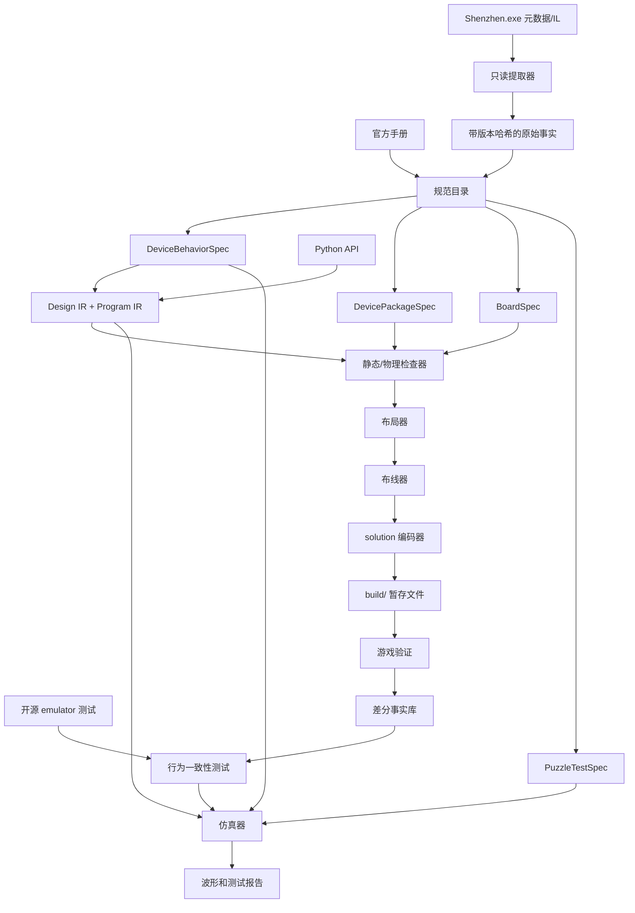

# SHENZHEN I/O 外部工具链总体执行规划

更新日期：2026-07-17

## 1. 最终目标

构建一套不依赖游戏 GUI 编辑电路的本地工具链：

```text
Python 方案代码
    -> 类型化电路 IR
    -> 静态合法性检查
    -> 布局与布线
    -> solution.txt
    -> 外部仿真与 testbench
    -> 游戏最终验证
```

最终应做到：

- 用 Python 类表达开发板、器件、引脚、网络和芯片程序。
- 自动读取当前游戏版本中的器件与谜题元数据，避免靠截图猜引脚。
- 生成游戏可以直接加载的完整 solution 文件。
- 在写入游戏目录前发现放置、接线、代码和时序错误。
- 在外部运行 MCxxxx、Simple I/O、XBus 和常见外设仿真。
- 支持自动布局、自动布线和多目标优化。
- 游戏仍是最终行为裁判；工具链不能把近似仿真宣称为官方等价实现。

## 2. 约束与原则

### 2.1 权威来源顺序

发生冲突时按以下顺序裁决：

1. 当前本地 `Shenzhen.exe` 和它生成的 solution 文件。
2. 当前版本游戏中的实际运行结果。
3. 英文/中文官方手册。
4. 官方自定义谜题 Lua 接口。
5. 开源 emulator 的实现和测试。
6. 社区文档与论坛讨论。

开源 emulator 用于补充行为假设和测试样例，不能作为物理封装数据库的权威来源。

### 2.2 数据必须带来源

所有器件和开发板事实都应记录：

- 来源文件及游戏版本哈希。
- 提取方式或人工判断依据。
- `extracted`、`manual`、`inferred`、`verified-in-game` 状态。
- 仍未确认的字段，不能用默认值伪装成已知事实。

### 2.3 不安装大型 C# 工具链

- 不要求 Visual Studio、C# SDK、ILSpy 或修改后的游戏程序。
- 使用 PowerShell `ReflectionOnlyLoadFrom` 读取程序集元数据和 IL。
- 提取过程不得执行游戏静态构造函数，不修改 `Shenzhen.exe`。
- 提取结果是小型 JSON 文件，并记录 `Shenzhen.exe` 的 SHA-256。

### 2.4 安全写入

- 构建结果先写入项目 `build/`。
- 游戏运行时禁止安装到存档目录。
- 安装前备份，使用临时文件加原子替换。
- 不覆盖无法完整解析和回写的未知字段。

## 3. 当前基线

| 能力 | 当前状态 | 主要缺口 |
|---|---|---|
| solution 解析/写回 | 已有基础实现 | 需要 corpus 级无损 round-trip |
| Trace 位掩码 | 已按游戏实现 `Exists=0x10`、方向位、左下原点和存档反向行序 | 需要 corpus round-trip 与游戏差分测试 |
| Python 电路 API | 可放置器件、连网、写程序 | 程序仍过度接近字符串，需要指令 AST |
| 器件库 | 已自动提取 66 个 `ChipType`、pin 索引及两种朝向的接点；3 个手册基准已验证 | 需要补全行为分类并让运行时 API 全部改为目录驱动 |
| 开发板库 | 50 个 `BoardSpec` 已包含 4979 个可布线格、放置边界和 198 个 terminal 接点 | 需要让运行时 `Board` 全部目录驱动 |
| 静态检查 | 已检查放置边界、碰撞、线路合法性和 API/物理网络一致性 | 缺特殊器件、驱动冲突和完整代码规则 |
| 自定义谜题 | 可提取 Lua 板面和 terminal 元数据 | 缺完整语义和安全执行模型 |
| 布局/布线 | 已有确定性 Lee 多网 router 和网络顺序回溯 | 缺 bridge、初始线、route hints、协商拥塞和 placer |
| 仿真器 | 未实现 | 需要 VM、调度器、网络和外设 |
| Testbench | 未实现 | 需要事件流、波形断言和官方差分样例 |
| 游戏闭环 | 已有进程检查和 install 雏形 | 需要批量验证和结果记录 |

当前回归基线：28 个单元测试通过，`Sz035` 示例可自动布线并通过静态/物理检查。

## 4. 目标架构



## 5. 核心数据模型

### 5.1 `DeviceBehaviorSpec`

描述与摆放无关的逻辑行为：

- 逻辑引脚名称、Simple/XBus 类型和方向。
- 寄存器、数值范围、程序行数。
- 指令集和功耗规则。
- 外设状态转移、读写和时序行为。

### 5.2 `DevicePackageSpec`

描述游戏编辑器中的物理封装：

- solution `[type]` 标识。
- 宽高、旋转和绘制原点。
- 占用格、阻塞格和碰撞边界。
- 每个引脚的接触格和朝向。
- 成本、解锁/可用性、是否推荐使用。

### 5.3 `BoardSpec`

描述某一道题的开发板：

- 谜题 ID、板面尺寸、tile 和禁布区域。
- 外部 terminal 的类型、方向、位置和名称。
- puzzle-provided 器件、位置、旋转和初始连线。
- 允许器件集合和特殊规则。

### 5.4 `PuzzleTestSpec`

描述验证时序：

- 输入生成器及随机种子规则。
- 期望输出生成器。
- 测试轮数、tick 数和比较方式。
- 无法静态提取时允许使用有来源的人工波形夹具。

### 5.5 `DesignIR` 与 `ProgramIR`

- `DesignIR`：器件实例、放置约束、类型化网络、开发板端口。
- `ProgramIR`：指令、标签、操作数、条件前缀和源位置。
- 保存格式字符串只能在 encoder 边界出现，不能渗入用户 API 和检查器。

## 6. 完整阶段计划

### Phase 0：基线与证据框架

状态：部分完成。

任务：

- 固化当前 9 个测试和 `Sz035` 示例为基线。
- 建立 `fixtures/saves/`、`fixtures/metadata/`、`fixtures/game-observations/`。
- 保存当前 `Shenzhen.exe` SHA-256、文件版本和提取器版本。
- 让测试无需手工设置 `PYTHONPATH` 即可运行。
- 区分单元测试、golden 测试、差分测试和游戏端到端测试。

退出条件：

- 新环境中一个命令可以运行全部离线测试。
- 所有事实夹具都带来源和版本信息。

### Phase 1：游戏程序集只读提取器

状态：主体完成。可行性门槛 G1 已通过，规范化工作已进入 Phase 2。

当前提取结果：

- 当前 `Shenzhen.exe` SHA-256 已记录。
- 找到 1071 个托管类型和 66 个静态 `ChipType` 字段。
- 已导出 `ChipTypes` 初始化方法和 `Puzzles..cctor` 的完整 IL。
- 自动找到一个 `String(Int32)` 字符串解码候选及其 85 KB 嵌入资源。
- 已静态恢复字符串索引/解码密钥，当前 365 个引用 ID 全部可解码。
- 已把 `ChipTypes` 初始化路径切分为 66 个器件记录，66 个名称和类型 ID 均可恢复。
- 已恢复器件价格、尺寸、解锁条件、引脚种类、寄存器映射、左右物理槽位，以及未旋转/旋转后的精确接点偏移。
- 已切分 50 个官方 `Puzzle`，恢复 198 个 terminal 和 44 个 provided-chip 实例。
- 50 块板的 RVA 初始化数据全部静态读出：全局画布为 22×14；tile 数组中 45 块为 22×14，5 块为 22×11。
- consumer IL 证明每个板格由 3 个整数构成：纹理索引、顺时针四分之一圈数和翻转位；翻转位 0/1 分别控制水平/垂直翻转。
- 编辑器 IL 证明纹理索引 1 和 9 是可布线格；全部 50 块板合计 4979 个可布线格。
- 编辑器放置路径证明普通器件必须包含在 `(1,1)` 起、画布宽高各减 2 的区域内，且不能互相重叠；`BRIDGE` 可与其中间格的 `TERMINAL` 特例重叠。
- solution 读写 IL 证明 `Trace.Exists=0x10`，`.` 表示 0，`0..F` 表示带 Exists 的方向位；文本行按最高 y 到最低 y 排列。
- 编辑器和仿真路径证明 terminal 与 provided-chip 的 `Index2` 都直接使用存储坐标，不存在额外平移。
- `Chip`/`Pin` 消费路径证明 pin 接点由芯片尺寸、pin 索引和 180 度旋转唯一决定；特殊 `TERMINAL` pin 固定在原点。
- `Sz035` 已恢复 `radio-rx`、`buzzer`、provided RADIO 和 terminal-to-pin 3 绑定。
- 已生成全部 50 块板的规范化目录：7506 个非空 tile、198 个 terminal、44 个 provided part，未解析接点为 0。
- `Sz035` 的 RADIO 原点为 `(6,4)`，`radio-rx` 接点为 `(8,5)`，蜂鸣器接点为 `(15,5)`；与手工 `Board` 的 10 个可比字段一致。
- MC4000、MC6000、DX300 已与中英文手册对应页交叉校验；不一致时构建失败。
- DX300 左侧三个等价 XBus 仅使用生成别名，未伪装成手册官方名称。
- 全过程使用 reflection-only，未执行游戏静态构造函数。

任务：

- 枚举 `Chip`、`ChipType`、`ChipTypes`、`Pin` 及相关内部类型。
- 解码 `ChipTypes` 静态构造函数的 IL，不执行构造函数。
- 解析字符串 token、整数、`Index2`、数组、字典和构造器调用。
- 从使用这些字段的代码反推被混淆字段的含义。
- 沿 solution `[chip]/[type]` 反序列化路径找到类型 ID 映射。
- 枚举 `Puzzle`、`Puzzles`、`Terminal`、tile 和 provided-chip 初始化路径。
- 输出原始、可追溯的 JSON，不直接生成手写 Python 类。

可行性门槛 G1：

- [x] 至少正确提取 MC4000、MC6000、DX300 三种器件。
- [x] MC6000 的类型 ID、成本、尺寸和六个引脚与存档/手册一致。
- [x] 至少正确提取 `Sz035` 的 terminal、tile 或 provided-chip 数据之一。

如果 G1 失败，保留提取到的部分数据，其余字段转为带证据的人工 override；不能继续猜测。

### Phase 2：规范器件库和开发板库

状态：进行中。规范化 `BoardSpec` 和接点模型已落地，运行时目录驱动尚未完成。

任务：

- 将当前 `PartSpec` 拆成 behavior/package 两层。
- 建立 `GameSnapshot`、来源、置信度和 override 机制。
- 合并程序集事实、官方手册语义和 emulator 行为测试。
- 自动生成器件 Python 类，保留 `MC6000()`、`cpu.x0` 这种 API。
- [x] 为全部内置谜题生成 `BoardSpec`，无法提取字段显式标为 unknown。
- 将当前手填 `parts.py`、`boards.py` 降级为验证夹具或 override。

退出条件 G2：

- 当前存档 corpus 中所有 `[type]` 都能识别。
- 所有内置器件都有稳定 ID、封装和逻辑引脚定义。
- 所有内置谜题至少有板面尺寸和 terminal 清单。
- 生成数据可重复，换游戏版本会触发显式版本不匹配。

### Phase 3：保存格式与编译前端

状态：已有基础，需要补全。

任务：

- 将 solution 解析器升级为保留顺序、空行和未知字段的文档模型。
- 分离无损语法树与供编译器使用的语义模型。
- 支持全部 chip 字段、旋转、provided 标记、score 和未知扩展。
- [x] 为 TraceGrid 增加游戏坐标变换和连接合法性验证。
- 将 `ProgramBuilder` 改为类型化 `ProgramIR`，最后一步才渲染文本。
- 为 Python API 的错误保留方案文件和源码行位置。

退出条件 G3：

- 游戏生成的 corpus 可以无损或定义明确的语义等价 round-trip。
- Python 示例能稳定生成可再次解析的 solution。
- 未知字段不会被静默删除。

### Phase 4：完整静态和物理检查器

状态：进行中。放置边界、普通碰撞、线路互惠和物理网络检查已落地。

任务：

- [x] 检查普通器件越界、碰撞和板面可布线区。
- 根据封装和坐标计算真实接触引脚，禁止只按引脚名字假设接线。
- 检查 Simple/XBus、方向、自连接、多驱动和未连接引脚。
- 检查寄存器、操作数、标签、立即数、代码行数和芯片支持的指令。
- [x] 检查 Trace 的双向邻接和板面越界。
- 检查悬空线路、特殊跨越和非法终点。
- 输出稳定诊断码，供 CLI、测试和未来编辑器使用。

退出条件 G4：

- 对每条规则都有正例和负例。
- 能可靠捕获“代码访问 `p1`，物理线却接到 `x3`”等已知错误。
- checker 通过成为 build/install 的强制前置条件。

### Phase 5：物理布局与布线引擎

状态：进行中。步骤 1、单网 Lee、多端点树和基础多网回溯已实现。

任务按顺序推进：

1. [x] 明确坐标、占用格、接触格和 Trace graph 的唯一语义。
2. 支持用户固定位置和 route hints 的确定性布线。
3. [x] 实现单网络 Lee router。
4. 实现多端点网络、障碍、已有线复用和回溯。（多端点树、引脚障碍已完成）
5. 实现多网络协商拥塞与确定性重试。（网络顺序确定性重试已完成）
6. 加入桥接器和允许跨线的器件模型。
7. 实现约束布局器，并以可布通性而非仅曼哈顿距离评分。
8. 联合布局与布线搜索，提供超时和最优已知结果。

退出条件 G5：

- route hints、自动单网和自动多网均产生 checker 合法的 TraceGrid。
- 固定随机种子时输出完全可重复。
- 基准电路能被游戏加载，物理网络与 IR 网络一致。

### Phase 6：MCxxxx VM 与网络仿真

状态：未开始。

任务：

- 实现 MC4000、MC4000X、MC6000 的完整指令和寄存器语义。
- 实现标签、`@`、`+/-` 条件、睡眠、阻塞和功耗统计。
- 定义单 tick 内所有芯片和外设的调度阶段。
- 实现 Simple 网络持续电平和多节点组合规则。
- 实现 XBus 主动/被动收发、阻塞、仲裁和多值数据包。
- 逐个实现 DX300、RAM、逻辑门、LCD、无线电等外设行为。
- 将 Avas emulator 和 fengzhou-emu 的测试改写为独立一致性用例；无许可证项目只参考行为，不复制代码。

退出条件 G6：

- 每条指令都有边界和错误测试。
- Simple/XBus 有多设备、阻塞和竞争测试。
- 代表性微电路的逐 tick 波形与游戏观察一致。

### Phase 7：Testbench 与谜题验证模型

状态：未开始。

任务：

- 实现输入事件、期望波形、范围/窗口匹配和随机测试 API。
- 从 `Puzzles` 的测试委托和初始化代码提取可静态恢复的规则。
- 对不可恢复部分建立人工夹具，并明确它不是官方完整测试集。
- 支持失败时输出 tick、信号、芯片状态、阻塞原因和最近指令。
- 保存波形为 JSON，并提供终端可读差异报告。

退出条件 G7：

- `shzio test` 能运行完整设计而不需要 GUI。
- 至少一个内置谜题的全部已知测试波形与游戏一致。
- 随机/隐藏测试无法覆盖时，报告明确说明覆盖范围。

### Phase 8：游戏差分验证闭环

状态：已有 install 和进程检查雏形。

任务：

- `build` 只写暂存目录；`install` 检查进程、备份并原子替换。
- 批量生成小型语义探针，减少反复开关游戏的次数。
- 记录游戏是否成功加载、实际波形、功耗、成本和代码行数。
- 将每次游戏验证转成版本化 regression fixture。
- 对仿真差异做最小化，形成可重复微电路。

退出条件 G8：

- 从 Python 源码到游戏加载不再需要手工修改 solution 文本。
- 同一批探针可以一次安装、一次游戏会话验证、一次导回结果。
- 游戏更新后能快速识别哪些事实或行为发生变化。

### Phase 9：高级芯片编译 API

状态：后续功能，不阻塞低级工具链。

任务：

- 在 `ProgramIR` 上提供宏、结构化分支和受限状态机 API。
- 实现寄存器分配、标签生成、控制流分析和行数诊断。
- 实现常量传播、死代码删除、跳转简化和标签压缩。
- 所有高级结构必须能显示降级后的 MCxxxx 程序和资源报告。

退出条件：

- 高级 API 的输出和手写 `ProgramIR` 语义一致。
- 编译失败能解释寄存器或代码行数不足的具体原因。

### Phase 10：优化、全谜题覆盖与发布

状态：最终阶段。

任务：

- 为全部内置谜题补齐 BoardSpec、外设和 testbench 覆盖。
- 支持 Workshop/custom puzzle 的安全元数据导入。
- 对成本、功耗、代码行数建立 Pareto 搜索。
- 联合器件选择、程序变体、布局和布线进行搜索。
- 使用公开排行榜统计做目标尺度参考，不导入他人题解。
- 完善 CLI、文档、错误码、缓存、版本迁移和可重复构建。

最终完成标准：

- 所有内置器件和开发板均有可追溯规格。
- 所有支持的方案都能完成 parse/check/build/install 闭环。
- 代表性谜题可完成 route/sim/test/game differential 闭环。
- 自动生成结果无需 GUI 修线或改芯片引脚。
- 对尚未完全模拟的外设和谜题明确标注支持等级。

## 7. 关键路径

```text
程序集 IL 提取
  -> 权威器件封装和类型 ID
  -> 权威开发板/terminal 数据
  -> 完整物理检查
  -> 合法布线
  -> 游戏加载验证
  -> 精确仿真差分
  -> 高级编译和优化
```

不能绕过的两个前置条件：

1. 器件接触引脚和 Board terminal 坐标必须可靠。（已由消费者 IL 解出并全量验证）
2. 游戏事件调度和 XBus 时序必须通过差分实验确认。

因此当前可以开始实现板面合法性和 router；完整仿真仍须等待事件调度与 XBus 时序的差分确认，高级语言编译器继续排在 VM 之后。

## 8. 接下来三个工作包

### Work Package A：器件提取可行性验证（已完成）

- 创建只读程序集检查脚本。
- 输出类型、字段、构造器、静态字段和 IL token。
- 解出 MC4000、MC6000、DX300。
- 用手册、现有存档和 `Sz035` 物理测试交叉验证。

完成后即可决定器件库能否全自动生成。

### Work Package B：谜题和 provided-chip 提取（已完成）

- 跟踪 `Puzzles` 静态构造函数。
- 解析 terminal、tile、初始 Trace 和 provided chip 创建路径。
- 生成全部 50 个 `BoardSpec`，并将 `Sz035` 与当前手工 Board 做结构和坐标差异。

结果：可以批量覆盖所有官方开发板的结构、tile、terminal、provided part 和接点；tile 对放置合法性的影响仍属于检查器工作。

### Work Package C：规范模型重构

- 引入 behavior/package/board/provenance 四层。
- 让现有 API 从生成目录加载规格。
- 保持当前 `MC6000()` 示例兼容。
- 扩充 golden 和负例测试。

完成这三个工作包后，再进入 router 和 simulator 的大规模实现。

## 9. 风险登记

| 风险 | 影响 | 应对 |
|---|---|---|
| 程序集名称被混淆 | 字段含义难识别 | 按类型、常量、调用模式和消费者反推，不依赖名称 |
| 静态构造函数依赖纹理/运行时 | 直接反射取值可能执行游戏代码 | 只解析 IL，不调用字段值和构造函数 |
| `Puzzle` 不直接保存 provided chip | BoardSpec 不完整 | 跟踪初始 Solution 和编辑器初始化路径 |
| 游戏更新改变结构 | 提取器静默产错 | 绑定 SHA-256，未知版本强制重新验证 |
| XBus 调度顺序错误 | 仿真与游戏不一致 | 自动生成最小探针并做逐 tick 差分 |
| router 搜索爆炸 | 无法完成复杂板 | 合法性与优化分离，支持 hints、超时和最优已知结果 |
| 社区代码没有许可证 | 不能直接复用 | 只参考公开行为和测试思想，独立实现 |
| 自定义 Lua 不可信 | 执行任意代码 | 默认静态提取；未来执行必须放入隔离进程并限制 API |
| 游戏运行时覆盖存档 | 丢失构建结果 | staging、进程检查、备份、原子替换 |

## 10. 计划中的 CLI

```powershell
shzio extract-game --exe "...\Shenzhen.exe" --output data/raw
shzio catalog validate
shzio inspect solution.txt
shzio roundtrip solution.txt
shzio check solutions/example.py
shzio build solutions/example.py -o build/example.txt
shzio route solutions/example.py
shzio sim solutions/example.py
shzio test solutions/example.py tests/example.py
shzio install build/example.txt
```

## 11. 任务优先级规则

每次选择下一项工作时按以下顺序：

1. 先解决会导致生成无效 solution 的事实缺口。
2. 再解决无法判断合法性的 checker 缺口。
3. 再实现确定性生成能力。
4. 再实现行为仿真和测试覆盖。
5. 最后做搜索效率、代码简洁度和分数优化。

这保证工具链先做到“不会自信地生成错误文件”，再追求自动化程度和优化质量。
